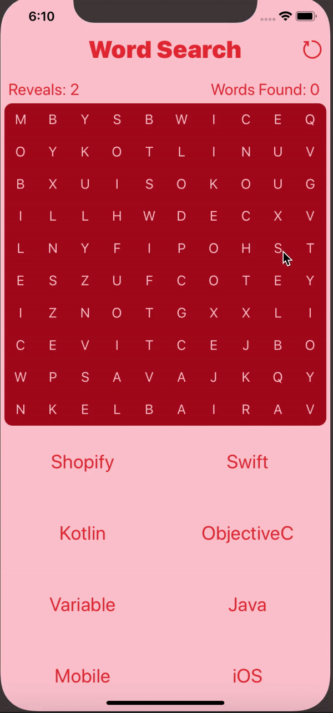
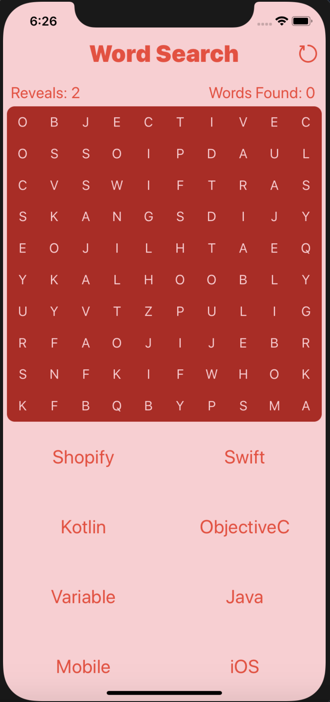
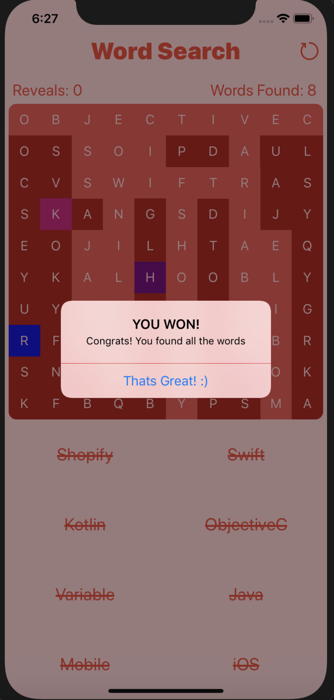
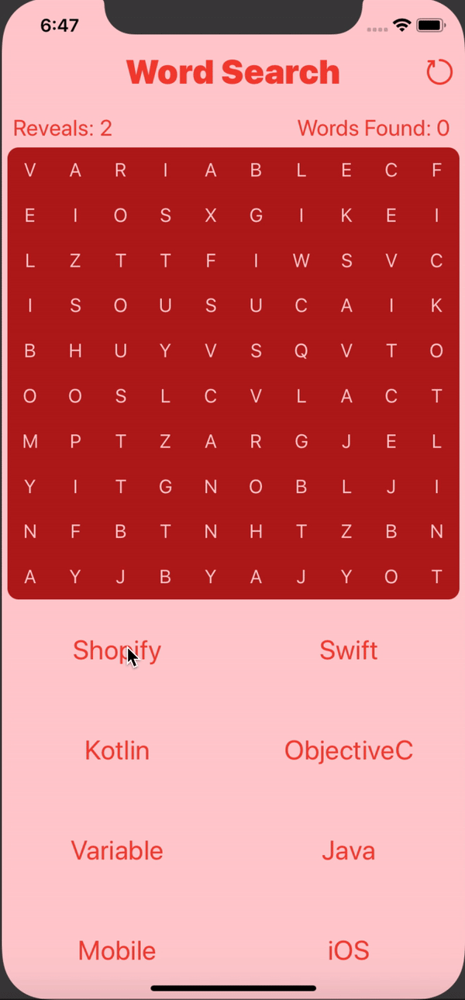
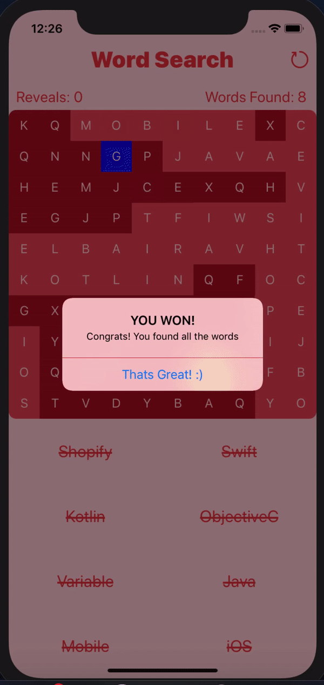

  

# Word Search 5 - Powered by Swift 5

    

## Shopify Challenge Task List: 
1. Create a Word Search iOS App ✔
2. Word search should have at least a 10 x 10 grid ✔ 
3. Include at least the following 6 words ✔
[Swift, Kotlin, ObjectiveC, Variable, Java, Mobile.]
4. Keep track of how many words a user has found ✔
5. Compiles successfully ✔
### Bonus:
6. Randomize word placement ✔
7. Make a slick UI with smooth animations ✔
8. Make it look good in portrait and landscape ✔
9. Allow users to find words by swiping over words ✔
10. Add additional features ✔

## Features
1. Nothing is hardcoded - Architecture supports changing game parameters by modifying a few variables. 
2. Word Selection can be done in two ways: 
    - Two-Tap selection
    - Swipe over words
3. Restart button: Users can restart the game anytime they want
4. Disco Effect: Users get to witness a disco effect (with smooth animations) on the grid every time they win.
5. AutoLayout: Supports any orientation on any device. (iPhones & iPads)
6. Special Edge Cases Handled: 
    - Duplicate Words in Grid: 
    There is a chance that the random letters in the grid could align to form a duplicate of one of the words in the word list, and this function is a helper function to handle that.
    However: the chance of this happening is really low, 0.005 % [ (1/26)^3 ] for a 3 - lettered word like iOS

## Future Improvements
1. Add support for diagonal words
2. Add sound effects / vibrations based on user 
3. Add JSON Input to modify Game Parameters such as:
    - List of words
    - Size of Grid
4. Add difficulty levels: Easy, Medium, Hard which modifies the size of the grid and the length of the words being placed.

## Screenshots

### 1. No Words Found ---> All Words Found

     

### 2. Slick Animations

     

### 3. AutoLayout: Portrait and Landscape Support

#### a. Portrait - iPhone XR

    

#### b. Landscape - iPhone XR

    

